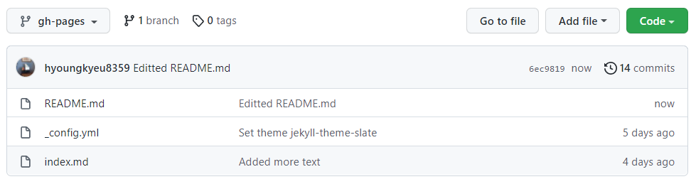
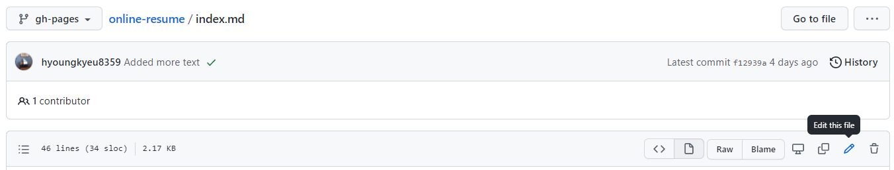
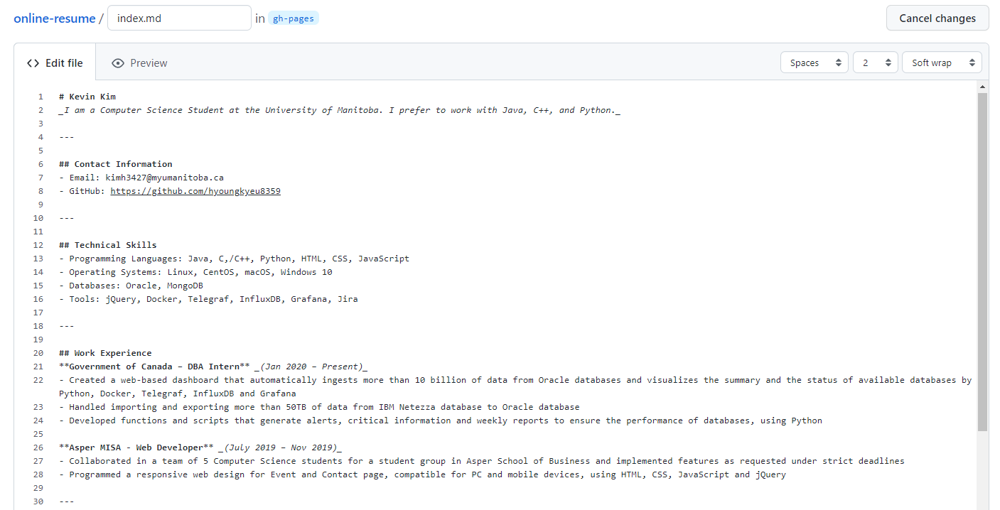
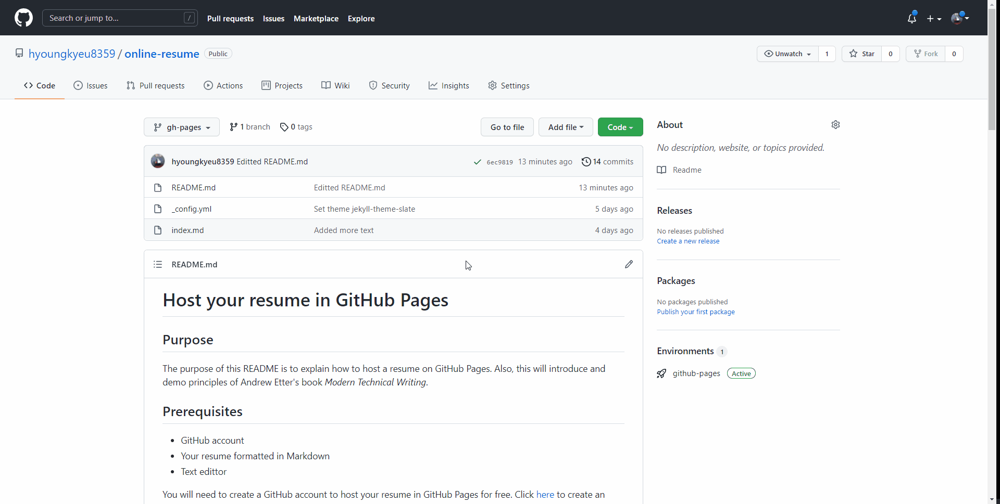

# Host your resume in GitHub Pages

## Purpose
The purpose of this README is to explain how to host a resume on GitHub Pages. Also, this will introduce and demo principles of Andrew Etter's book _Modern Technical Writing_.

## Prerequisites
- GitHub account
- Resume formatted in Markdown

You will need to create a GitHub account to host your resume in GitHub Pages for free. Click [here](https://github.com/) to create an account.

Also, you will need to convert your resume into Markdown format. Don't worry if you are new to Markdown. There are websites that provides tutorials for beginners. I strongly recommend this [website](https://www.markdowntutorial.com/) to get yourself familar to Markdown then write your resume in Markdown.

## Instructions

### 1. Create a new repository on GitHub

GitHub Pages allows use to host a resume as a static website for free (but only one per account). Andrew Etter recommends to make a static website:

> I love their speed, simplicity, portability, and security. You can host static websites practically anywhere, including Amazon S3 and GitHub Pages. They have no server-side application dependencies, no databases, and nothing to install, so migrating the entire site is as easy as moving a directory.

In general, static websites are fast. It does not consume hardware resources because no content is generated dynamically. 
When you need to make a change on your resume, simply edit and update it to your repository. Any update you make will be reflecetd in a blink of an eye. 

Let's create a new repository for your resume.

- On the top right corner, click **+** sign and **New repository**


- Name your repository as _online-resume_
- Set it as **Public** (default)
- Check **Add a README file**
- Click **Crate repository**


Your fresh repository for hosting resume should look like below.


### 2. Choose a theme for your resume

You should try to make your resume look appealing and approachable because a boring-looking resume won't attract anyone from human resources team. Etter mentions in his book that:

> Whichever tool you select, take the time to customize the theme. [...] This customization is your chance to differentiate your content from the thousands of ugly, disorganized sites of the world, so don't just use the default theme.

Thankfully, you don't have to design the template of your resume by yourself. GitHub provides many built-in jekyll theme templates that look succint and professional. All you need to do is choose one of the jekyll themes that looks appealing to you (and others).

In case if you want to learn more about what jekyll is, click [here](https://jekyllrb.com/) to learn more about it.

Let's choose a theme for your resume!

- Click **Settings** of your repository


- Scroll down and click **Pages** on the left navigation list


- Click **Choose a theme**


For this tutorial, we will use **Slate theme**.

- Click **Slate theme** (feel free to explore other themes, too)
- Then, click **Select theme**


- Click **Commit changes**


### 3. Enable GitHub Pages

After the step 2, your repository will have a newly created a branch called **gh-pages** which contains **index.md** and **_config.yml** files. GitHub Pages should be enabled automatically as well.

To see if your GitHub Pages is up:
- Go to **Settings**
- Select **Pages** section on the left navigation list. 
- Click the link in the green box. 


The URL will look like the below format.

```
https://<github-username>.github.io/<repository-name>/
```

For my resume, the URL will be:
```
https://hyoungkyeu8359.github.io/online-resume/
```

### 4. Replace index.md with your resume

The reason why your resume should be written Markdown format is because of it's easier to write and host in online platform. Etter explains why Markdown:

> Documentation should live online, and Word's abysmal HTML export is totally unsuitable for creating websites. [...] GitHub Flavoured Markdown is a popular and fine choice for simple web-based help systems.

Most people would use Microsoft Word to write their resume (and distribute PDF of their resume). However, as Etter stated in his book, .docx version of a resume is meant to be consumed and discarded. 

Writting a Markdown-formatted resume is easier to maintain and distribute in online. If you need to make a change to your resume, simply edit it, update the change to the repository, and it will stay fresh. I used to write my resume with Microsoft Word but I preferred Markdown more nowadays. Using Markdown feels much simple to write and easily distributable in GitHub Pages.

At this point, your website should contain default content. You will replace the content in **index.md** with your resume.

- Click **index.md** in your repository



- Click **Edit this file** (a pencil symbol)



- Replace the file with your resume
- Make sure to click **Preview** to see how your **index.md** will look like after change



- Click **Commit changes**


## Verify your resume

Once **index.md** is modified, visit your GitHub Pages to see if your resume looks fine. Your website should look similar to below animation (as long as you are sticking with slate theme).



You can visit my resume at https://hyoungkyeu8359.github.io/online-resume/

Enjoy you resume!

## More resources

- Click [here](https://www.markdowntutorial.com/) for Markdown tutorial
- Click [here](https://www.amazon.ca/Modern-Technical-Writing-Introduction-Documentation-ebook/dp/B01A2QL9SS) to purchase Andrew Etter's book _Modern Technical Writing_ in Amazon
- Click [here](https://docs.github.com/en/pages/getting-started-with-github-pages/about-github-pages) for detailed documentation of GitHub Pages

## Authors and Acknowledgments:

GitHub Pages and the jekyll-theme-slate provided by GitHub was very helpful for hosting my resume.

Andrew Etter's protocols introduced in his book _Modern Technical Writing_.

Thanks to Group 6 for reviewing my resume:
- Ryan Campbell - Peer reviewed this guide
- Joshua Moreira - Peer reviewed this guide
- Ikram Khan Shipon - Peer reviewed this guide
- Anton Sikorsky - Peer reviewed this guide

## FAQs 

**Q: Why is my resume not showing up?**

There are a few possibilities:
- You entered a wrong URL address.
- It takes a time to reflect any change you made in the repository. Keep refreshing the page!
- In the worst case, you might need to delete your repository and create a new one again.

**Q: Can I modify '_config.yml'?**

You may modify **_config.yml** as you wish, but please note that each theme have different configuration such that content in your **index.md** may not look optimized as you expected. You will need to verify your GitHub Pages to see if your resume looks fine.
