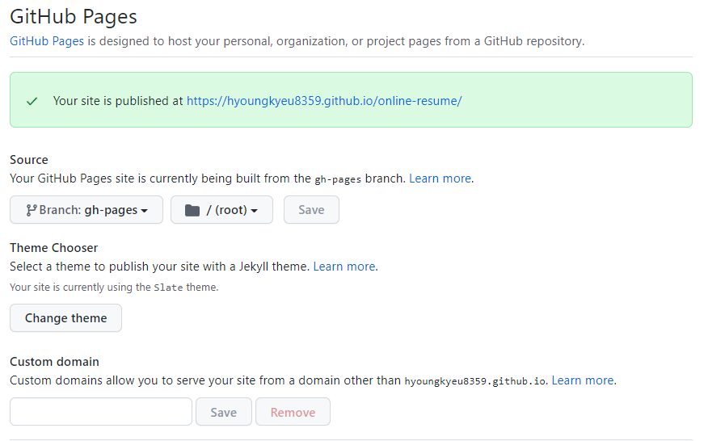

# Host your resume in GitHub Pages

## Purpose
The purpose of this README is to explain how to host a resume on GitHub Pages. Also, this will introduce and demo principles of Andrew Etter's book _Modern Technical Writing_.

## Prerequisites
- GitHub account
- Your resume formatted in Markdown
- Text edittor

You will need to create a GitHub account to host your resume in GitHub Pages for free. Click [here](https://github.com/) to create an account.

Also, you will need to convert your resume into Markdown format. Don't worry if you are new to Markdown. There are websites that provides tutorials for beginners. I strongly recommend this [website](https://www.markdowntutorial.com/) to get yourself familar to Markdown.

## Instructions

### 1. Create a new repository on GitHub

- On the top right corner, click **+** sign and **New repository**


- Name your repository as _online-resume_
- Set it as **Public** (default)
- Check **Add a README file**
- Click **Crate repository**


Your fresh repository for hosting resume should look like below.


### 2. Choose a theme for your resume

- Click **Settings** of your repository


- Scroll down and click **Pages** on the left navigation list


- Click **Choose a theme**


- Pick **Slate theme** (you can use other themes as well)
- Then, click **Select theme**


- Click **Commit changes**


### 3. Enable GitHub Pages

After the step 2, your repository will have a newly created a branch called **gh-pages** which contains **index.md** and **_config.yml** files. GitHub Pages should be enabled automatically as well.

To see if your GitHub Pages is up:
- Go to **Settings**
- Select **Pages** section on the left navigation list. 
- Click the link in the green box. 



The URL will look like the below format.

```
https://<github-username>.github.io/<repository-name>/
```

For my resume, the URL will be:
```
https://hyoungkyeu8359.github.io/online-resume/
```

### 4. Replace index.md with your resume

At this point, your website should contain default content. You will replace the content in **index.md** with your resume.


### 5. Verify your resume

Once **index.md** is modified, visit your GitHub Pages to see if your resume looks fine. Your website should look similar to below animation.

(Add GIF animation)

## More resources

- Click [here](https://www.markdowntutorial.com/) for Markdown tutorial
- Click [here](https://www.amazon.ca/Modern-Technical-Writing-Introduction-Documentation-ebook/dp/B01A2QL9SS) to purchase Andrew Etter's book _Modern Technical Writing: An Introduction To Software Documentation_ in Amazon
- Click [here](https://docs.github.com/en/pages/getting-started-with-github-pages/about-github-pages) for detailed documentation of GitHub Pages


## Authors and Acknowledgments:

- GitHub Pages and the jekyll-theme-slate provided by GitHub was very helpful for hosting my resume. 
- Thanks to Group 6 for reviewing my resume.

## FAQs 

**Q: Why is my resume not showing up?**

There are a few possibilities:
- You entered a wrong URL address.
- It takes a time to reflect any change you made in the repository. Keep refreshing the page!
- In the worst case, you might need to delete your repository and create a new one again.

**Q: Can I modify '_config.yml'?**

You may modify **_config.yml** as you wish, but please note that each theme have different configuration such that content in your **index.md** may not look optimized as you expected. You will need to verify your GitHub Pages to see if your resume looks fine.
